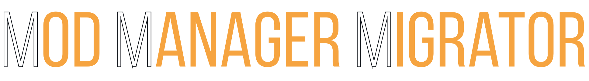

<picture>
  
</picture>

<picture>
  
</picture>
 

 
<strong>MMM - Move Mods Masterfully.</strong>

# ❗Please note!!!

**I take no responsibility for any problems that may occur.**

# 📄Description

This is a tool for migrating modding instances between various mod managers.

**Only Windows is supported!**

# 🕹Features

- Fully automated migration
- New instance is customizable
- Hardlink and copy method

### Supported Games

- Enderal (Special Edition)
- Fallout 3
- Fallout 4
- Fallout: New Vegas
- Oblivion
- Skyrim (all versions incl. GOG)

#### Planned games

- Nehrim
- Morrowind
- You (the community) decide, feel free to suggest

### Supported Mod Managers

- Vortex
- Mod Organizer 2

#### Planned Mod Managers

- Nexus Mod Manager Community Edition
- Feel free to suggest

### Known Issues/Limitations

- Cannot migrate from Vortex if it is used in "Shared" mode ([Vortex &gt; Settings &gt; Vortex](https://imgur.com/fyKAgK7))
- Some Windows Defender versions may detect MMM as malware and delete the executable

# 🔧Usage

### To migrate an instance, follow these steps:

1. Click on "Add source", select your source and click on "Next".
2. Select the instance you want to migrate and click on "Done".
3. Click on "Add destination", select your destination and click on "Next".
4. Set paths as you like it and click on "Done".
5. Click on "Migrate" and wait for it to finish.

# 🫶Contributing

### 1. Translations

Create your translation for your desired language from en_US under `<Path to MMM>`/res/loc. Put it in the locales folder and make a pull request.
I strongly recommend using QtLinguist. A VS Code task is already set up in the .code-workspace file to open QtLinguist with the German localisation.

### 2. Feedback (Suggestions/Issues)

If you encountered an issue/error or have a suggestion, open an issue with sufficient information.

### 3. Install requirements

1. Install [Python 3.12](https://www.python.org/downloads/) (Make sure that you add it to PATH!)
2. Install [uv](https://github.com/astral-sh/uv#installation)
3. Clone repository
4. Open terminal in repository folder
5. Run the following command to init your local environment and to install all dependencies
   `uv sync`

### 4. Execute from source

1. Open terminal in src folder
2. Execute main file with uv
   `uv run src\main.py`

### 5. Compile and build executable

1. Run `build.bat` with activated virtual environment from the root folder of this repo.
2. The executable and all dependencies are built in the `dist/MMM`-Folder and gets packed in a `dist/MMM v[version].zip`.

# 💻How it works

### Mod order from Vortex conflict rules:

1. It reads Vortex's level database
2. Creates dict of mods and overwriting mods
3. A load order is constructed according to the overwrites

### Vortex conflict rules from mod order

1. Scans all files in all mods
2. Checks for overwritten mods
3. Creates a rule for every overwritten mod

# 🔗Credits

- Code by Cutleast ([GitHub](https://github.com/Cutleast) | [NexusMods](https://www.nexusmods.com/users/65733731))
- Design and idea by Wuerfelhusten ([NexusMods](https://www.nexusmods.com/users/122160268))
- Qt by The [Qt Company Ltd](https://qt.io)
- FontAwesome Icons by [FontAwesome](https://github.com/FortAwesome/Font-Awesome)
